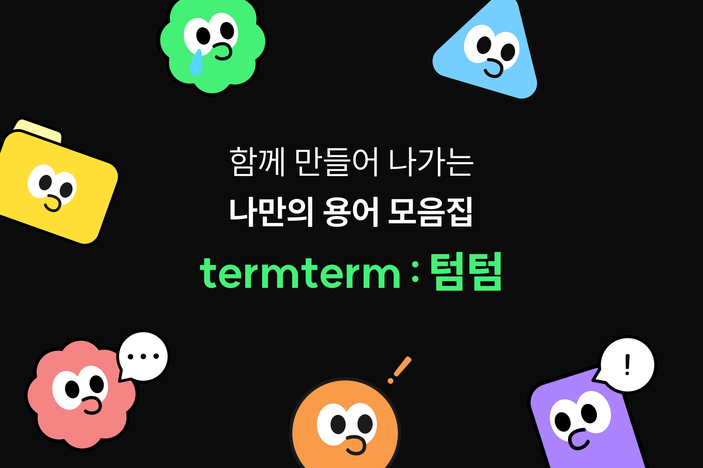
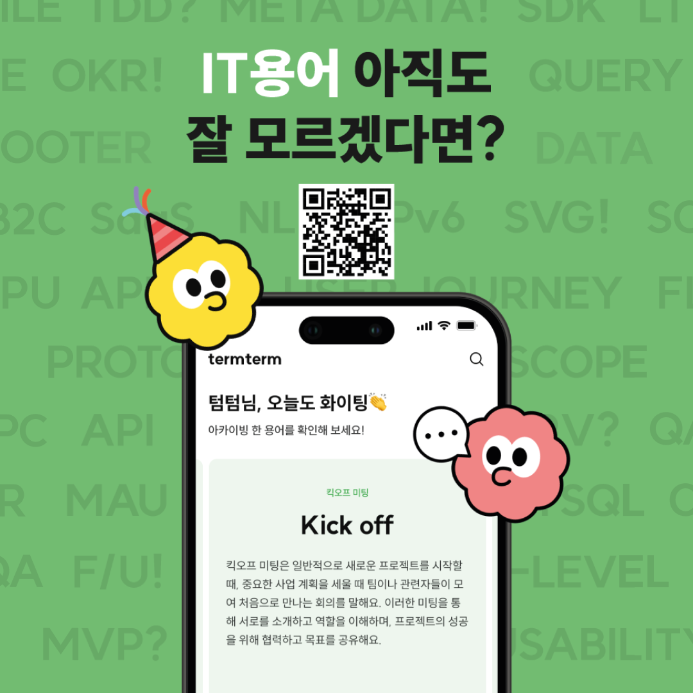
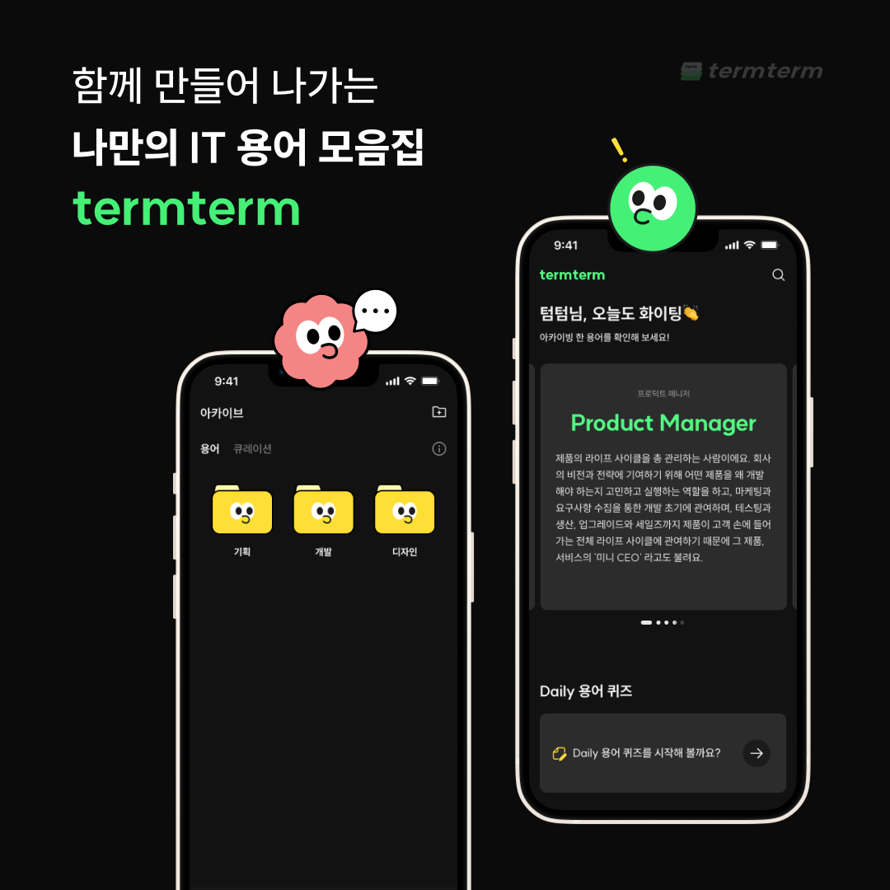
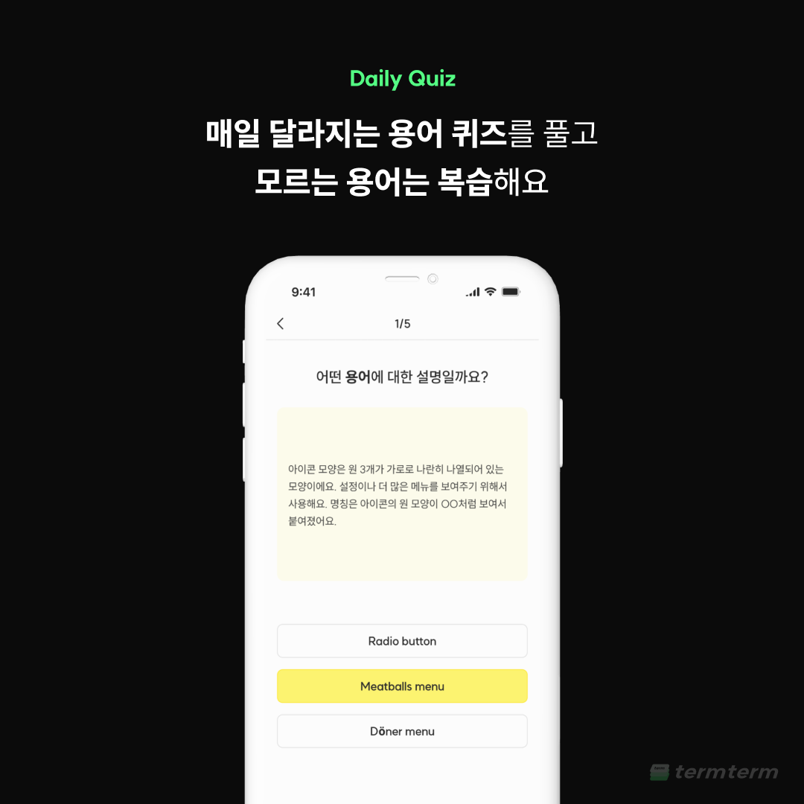
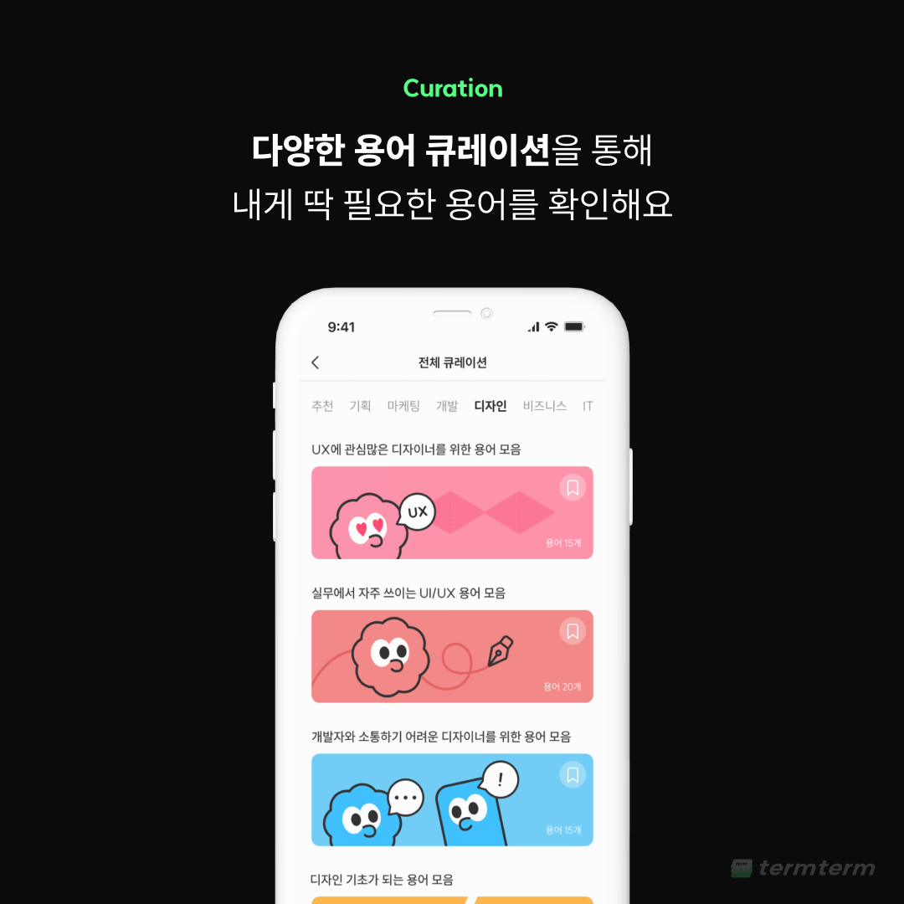
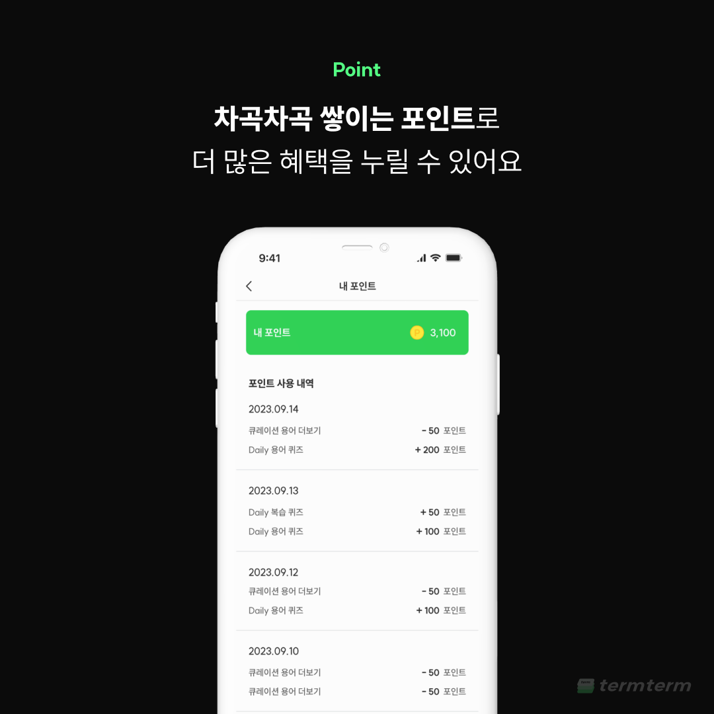
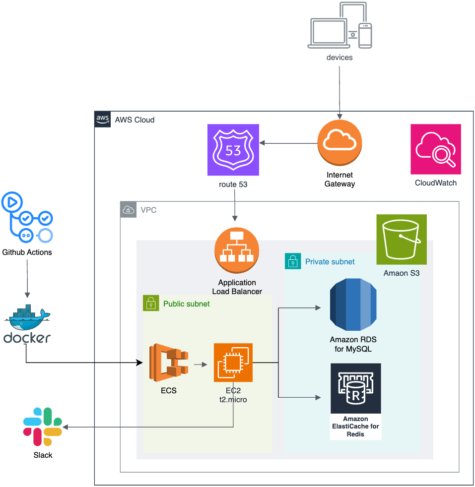
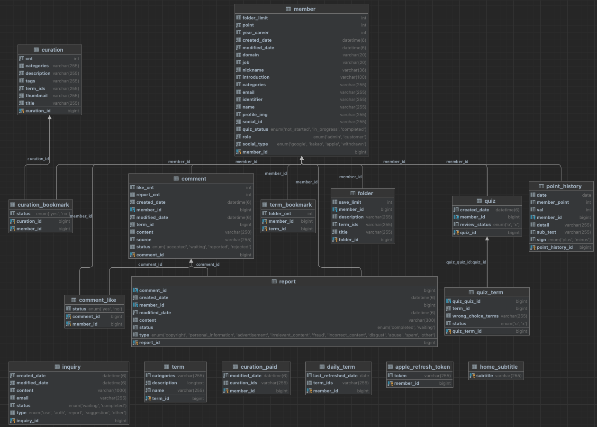

# 나만의 용어 모음집 termterm: 텀텀  

   

### 서비스가 종료되었습니다. (~ 2024.07)

  

## 🔎 Introduction

    
    
    
    
    
    

  

<a style="font-size: 180%; font-weight: bold" href="https://www.termterm.site" target="_blank">텀텀을 더 자세히 알고싶다면? 🔗 소개 페이지 바로가기</a>

  

## 💻 Server Architecture
### 📦 Dependency
- Java 17, Junit 5
- Spring Boot 3.2.2
- MySQL, Redis

 

### 🤲 Back-end Server Architecture Diagram

  

 

### 🛠️ Tech Stack
#### Framework -   
#### Database -  
#### ORM -   
#### Deploy -  
#### Logging -  
#### API Docs - 
#### Performance Test - 
#### Test - 

  

## 🖇️ ERD

  

  

## 🙋🏻‍♂️ Server Engineer
|                                                     Seungwoo, Joo                                                     |
|:---------------------------------------------------------------------------------------------------------------------:|
|   

  

## 🔗 Etc

**Contact: termterm.contact@gmail.com**

***© 코메르(Commer) ALL RIGHTS RESERVED***